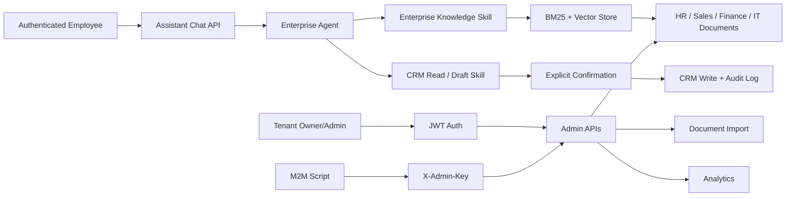

# SmartCS

SmartCS is a multi-tenant enterprise employee Agent sample built with Python,
FastAPI, RAG, controlled CRM operations, JWT authentication, and test coverage.

It is positioned as an enterprise AI application engineering sample, not a
simple FAQ chatbot. The important question it answers is:

> How do we make one enterprise Agent safely serve employees across knowledge
> questions and controlled business actions, where permissions, confirmation,
> auditability, and tests matter as much as the chat response?

## Why It Matters

For companies, the value is not "a bot can chat." The value is controlled AI
workflow around company knowledge:

- Multi-tenant boundary: each company or business unit has isolated knowledge,
  documents, admin access, and API keys.
- Governed RAG: knowledge can be imported, chunked, searched, listed, updated,
  archived, and traced through admin APIs.
- One authenticated enterprise assistant: it dynamically exposes corporate
  knowledge and CRM Skills based on the current user role.
- It keeps the latest ten turns per authenticated employee session; knowledge
  entries may optionally be restricted to specific roles (empty means all staff).
- Controlled CRM workflow: the assistant may prepare a lead/task change, but
  only an explicit user confirmation performs the write.
- Human escalation: uncertain or sensitive cases can be routed to people.
- Operational backend: admins can manage documents, knowledge, analytics, and
  tenant-scoped access.
- Engineering evidence: pytest coverage protects RAG, agent tools, SSE,
  security cases, tenant isolation, and JWT auth.

## Core Capabilities

- FastAPI backend with tenant-aware routes.
- SQLite + SQLAlchemy models for tenants, knowledge, documents, conversations,
  analytics, admin API keys, and users.
- ChromaDB vector storage and BM25 retrieval.
- Document import for txt, md, pdf, docx, and xlsx.
- RAG retrieval with cache layers.
- Tool-calling enterprise agent with role-scoped knowledge and CRM Skills.
- Structured operational logs for requests, Agent lifecycle, tool calls, and
  controlled-write outcomes; logs contain identifiers and error codes, not
  business payloads.
- SSE streaming endpoint.
- Admin APIs for knowledge, documents, and analytics.
- JWT authentication:
  - owner self-registers and creates a tenant.
  - owner/admin can create tenant users.
  - employee receives knowledge access only; agent receives CRM access too.
  - Bearer JWT and `X-Admin-Key` both enforce tenant boundaries.
- Local CRM sales-assistant MVP: customer overview, lead/task action drafts,
  explicit confirmation, role checks, duplicate-lead protection, audit logs,
  and idempotent confirmation. It uses fictional local SQLite data only.
- Alembic migration for the `users` table.
- 100+ automated tests.

## Architecture



## Local Environment

Current local project root:

```powershell
D:\2026.07.09\AAA\smart-cs
```

Recommended Python:

```powershell
D:\2026.07.09\conda-envs\smart-cs\python.exe
```

Large local caches should stay on D drive:

```powershell
D:\2026.07.09\smartcs-cache\pip
D:\2026.07.09\smartcs-cache\huggingface
D:\2026.07.09\smartcs-cache\torch
```

## Run

```powershell
cd D:\2026.07.09\AAA\smart-cs

& D:\2026.07.09\conda-envs\smart-cs\python.exe -m uvicorn app.main:app --host 127.0.0.1 --port 8000
```

Health check:

```powershell
Invoke-RestMethod http://127.0.0.1:8000/health
```

Expected shape:

```json
{"status":"ok","version":"0.1.0","database":"ok","chromadb":"ok"}
```

## Test

```powershell
& D:\2026.07.09\conda-envs\smart-cs\python.exe -m pytest tests/ -v
```

Run the test command above before each delivery. The focused enterprise-Agent
regression suite covers role-scoped Skills, history isolation, knowledge
audiences, controlled CRM writes, security, and streaming behavior.

## Demo

After logging in, open `/static/assistant.html` for the unified employee-Agent
demo. The first-run `demo` tenant receives one fictional customer record;
register an owner, sales agent, or employee account through the auth API before
logging in.

`/api/v1/{tenant_slug}/assistant/*` is the primary application surface. The
older `/chat` and `/business` routes remain for regression coverage and API
compatibility, but are marked deprecated in OpenAPI and are not the demo entry.

For a fully local demo that does not call external embedding APIs, start the app
with `EMBEDDING_PROVIDER=hash`. To avoid mixing demo vectors with your normal
local data, use a temporary SQLite database and Chroma directory:

```powershell
$demoRoot="D:/2026.07.09/smartcs-cache/demo-" + (Get-Date -Format "yyyyMMdd-HHmmss")
New-Item -ItemType Directory -Force -Path $demoRoot | Out-Null
$env:EMBEDDING_PROVIDER="hash"
$env:DATABASE_URL="sqlite:///$demoRoot/smartcs-demo.db"
$env:CHROMA_PERSIST_DIR="$demoRoot/chroma"
$env:LOG_DIR="$demoRoot/logs"
& D:\2026.07.09\conda-envs\smart-cs\python.exe -m uvicorn app.main:app --host 127.0.0.1 --port 8000
```

Then run:

```powershell
& D:\2026.07.09\conda-envs\smart-cs\python.exe scripts\demo_enterprise_flow.py
```

The demo script shows:

- owner tenant registration.
- JWT login/auth flow.
- authorized sales-agent and knowledge-only employee creation.
- agent forbidden from admin access.
- cross-tenant access denied.
- knowledge creation and admin listing.
- document upload and imported chunk count.
- role-scoped unified assistant route and backend analytics view.

Full LLM answer quality still depends on `.env`, but the `hash` embedding mode
lets the governance, knowledge, and document-import demo run without consuming
embedding quota.

Latest local demo result:

```text
owner register: 201
agent creation: 201
employee creation: 201
agent admin access: 403
knowledge creation: 201
document upload: 201, status=ready, chunk_count=1
assistant route: 200 when LLM is configured, 503 is acceptable when LLM key is absent
knowledge/documents/analytics backend views: 200
cross-tenant admin access: 403
```

## Interview Summary

Resume bullet:

> Built a multi-tenant enterprise employee Agent with FastAPI, enterprise RAG,
> role-scoped CRM Skills, confirmation-gated writes, JWT tenant access control,
> audit logs, and automated tests.

Two-minute explanation:

> SmartCS is not just a chat API. I treated it as one enterprise employee Agent:
> users first authenticate, then the Agent receives only the Skills their role
> permits. All employees can query enterprise knowledge; sales users can query
> CRM facts and prepare business changes; confirmed changes are revalidated,
> idempotent, and audited. The JWT work enforces tenant boundaries before any
> Skill is selected or data is read.

See [docs/interview/SMARTCS_INTERVIEW.md](docs/interview/SMARTCS_INTERVIEW.md)
for resume bullets and interview talking points. See
[docs/interview/SMARTCS_DELIVERY_PACKAGE.md](docs/interview/SMARTCS_DELIVERY_PACKAGE.md)
for the final job-search delivery package, and see
[docs/interview/SMARTCS_FINAL_PITCH.md](docs/interview/SMARTCS_FINAL_PITCH.md)
for role-specific resume and interview wording. See
[docs/interview/SMARTCS_DEMO_SCRIPT.md](docs/interview/SMARTCS_DEMO_SCRIPT.md)
for a short Chinese demo script.

## Scope Boundaries

This project intentionally does not claim to be a finished commercial SaaS.
Current focus is engineering proof:

- backend AI application architecture.
- RAG and document import.
- role-scoped knowledge and CRM Skills.
- confirmation-gated business writes and auditability.
- tenant governance and authentication.
- practical tests and local reproducibility.

Future production work would include invitation flows, production secret
management, deployment hardening, CI/CD, and stronger observability.
