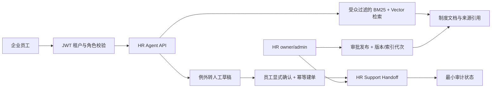

# SmartCS

SmartCS 是一个面向企业内部员工的多租户 HR 服务 Agent 后端工程样板。它的主线不是“聊天”，而是把制度知识问答、来源引用、例外转人工、员工确认、HR 处理和租户边界放进同一条可测试服务链路。

## 核心闭环

1. 员工通过 JWT 进入所属租户。
2. owner/admin 上传制度原件；新版本经质量门禁和人工审批后，才切换为员工可检索的当前版本。
3. HR Agent 从本人可访问的当前制度版本中检索，并在回答中提供 `[source:<id>]` 引用。
4. 制度没有覆盖、信息不足或员工明确要求人工处理时，Agent 只创建待确认草稿。
5. 员工显式确认后，后端以幂等键创建正式 HR 支持请求，并记录最小审计状态。
6. owner/admin 指派或解决请求；员工只能查看自己的状态。
7. 文档、检索、工单和 API 都按租户与角色做后端边界校验。

## 项目价值

这不是把 LLM 接到 FAQ 上，而是演示企业 AI 应用的受控落地：身份先行、知识有受众、回答可溯源、例外可转人工、业务状态由后端确认和治理。它适合作为 Python AI 后端、RAG 与 Agent 应用工程能力的作品证明。

## 技术栈

- FastAPI、SQLAlchemy、Alembic、SQLite
- JWT 多租户认证与角色授权
- ChromaDB 向量检索与 BM25 混合检索
- 文档治理：txt、md、pdf、docx、xlsx；OCR/结构化分块、质量门禁、原件留存、审批发布与失败安全 reindex
- 基于 LangChain tool calling 的受限 HR Agent
- pytest 自动化回归测试

## 架构



## 角色边界

| 角色 | 主要能力 |
| --- | --- |
| employee | 查询本人可见制度、确认草稿、查看自己的支持请求 |
| admin | 管理本租户用户与文档、指派或解决 HR 支持请求 |
| owner | 创建租户并拥有本租户管理能力 |

所有读取和状态变更都在后端校验租户与角色，而不是依赖前端隐藏按钮。

## 本地环境

当前项目根目录：

```text
D:\2026.07.09\AAA\smart-cs
```

推荐 Python：

```text
D:\2026.07.09\conda-envs\smart-cs\python.exe
```

运行实时演示前，在 `.env` 配置 `LLM_API_KEY`、`LLM_BASE_URL`、`LLM_MODEL`、`EMBEDDING_API_KEY`、`EMBEDDING_BASE_URL` 和 `EMBEDDING_MODEL`。不要把这些值提交、打印或贴进截图。

## 测试

```powershell
cd D:\2026.07.09\AAA\smart-cs
& D:\2026.07.09\conda-envs\smart-cs\python.exe -m pytest tests -q
```

## 实时演示

完整的两终端演示、临时数据库位置、模型失败说明和排障方法见：[本地 HR Agent 演示手册](docs/operations/local-hr-agent-demo.md)。

该演示会创建虚构的“北辰科技”租户及临时用户，依次展示文档上传、审批发布、带来源引用的制度回答、无中断 reindex、待确认转人工、正式建单、HR 指派/解决、员工查状态与跨租户 `403`。若模型或提供方返回 `503`，演示脚本会失败退出；这代表配置、网络或额度问题，不是成功结果。

## 面试交付材料

- [3 分钟演示稿](docs/interview/SMARTCS_DEMO_SCRIPT.md)
- [面试深聊要点](docs/interview/SMARTCS_INTERVIEW.md)
- [求职交付包](docs/interview/SMARTCS_DELIVERY_PACKAGE.md)
- [最终项目表达稿](docs/interview/SMARTCS_FINAL_PITCH.md)

## 范围边界

SmartCS 是企业 AI 应用工程样板，不宣称已经是上线运营的商业 HR SaaS。当前未实现 SSO/SCIM、真实 HRIS 或工单系统适配、通知与 SLA、完整链路追踪指标、CI/CD 及生产密钥治理。

`/business/*` 是保留用于历史回归覆盖的 JWT 保护 Sales Copilot Lab，不是主路径，也不在本项目的面试演示中作为核心价值呈现。
