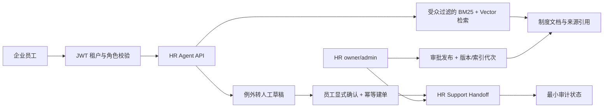

# SmartCS

SmartCS 是一个面向企业内部员工的多租户 HR 服务 Agent 后端工程样板。它的主线不是“聊天”，而是把制度知识问答、来源引用、例外转人工、员工确认、HR 处理和租户边界放进同一条可测试服务链路。

## 核心闭环

1. 员工通过 JWT 进入所属租户。
2. owner/admin 上传制度原件；新版本经质量门禁和人工审批后，才切换为员工可检索的当前版本。
3. HR Agent 从本人可访问的当前制度版本中检索；后端保留 `[source:<id>]` 机器引用用于授权校验，员工界面显示 `来源：《制度名称》`。
4. 制度没有覆盖、信息不足或员工明确要求人工处理时，Agent 只创建待确认草稿。
5. 员工显式确认后，后端以幂等键创建正式 HR 支持请求，并记录最小审计状态。
6. owner/admin 指派或解决请求；员工只能查看自己的状态。
7. 文档、检索、工单和 API 都按租户与角色做后端边界校验。

## 项目价值

这不是把 LLM 接到 FAQ 上，而是演示企业 AI 应用的受控落地：身份先行、知识有受众、回答可溯源、例外可转人工、业务状态由后端确认和治理。它适合作为 Python AI 后端、RAG 与 Agent 应用工程能力的作品证明。

## 冻结状态

`v0.1.0` 是 2026-07-21 验收的求职作品集快照：里程碑 1 企业 HR 服务 Agent 基座和里程碑 2 文档智能与知识治理均已交付；该标签快照完整回归为 `403 passed, 4 skipped`。2026-07-22 完成中文文档同步与员工助手页 HR 接口维护后，当前 `main` 回归为 `405 passed, 4 skipped`。项目继续处于维护冻结，不主动扩展功能；只处理可复现缺陷、敏感信息和求职展示材料。M3 真实 HR 工具接入与 M4 生产化加固保留为未来选做路线，不是当前快照的未完成缺陷。

## 技术栈

- FastAPI、SQLAlchemy、Alembic、SQLite
- JWT 多租户认证与角色授权
- ChromaDB 向量检索与 BM25 混合检索
- 文档治理：txt、md、pdf、docx、xlsx；可选 Docling/Tesseract OCR、结构化分块、质量门禁、原件留存、审批发布与失败安全 reindex
- 基于 LangChain tool calling 的受限 HR Agent
- pytest 自动化回归测试

## 架构



## 角色边界

| 角色 | 主要能力 |
| --- | --- |
| employee | 查询本人可见制度、确认草稿、查看自己的支持请求 |
| admin | 创建本租户成员、管理文档、指派或解决 HR 支持请求 |
| owner | 创建租户并拥有本租户管理能力 |
| agent | 兼容历史 Sales Copilot Lab 的角色，不属于 HR 主演示路径 |

所有读取和状态变更都在后端校验租户与角色，而不是依赖前端隐藏按钮。

## 本地环境

当前项目根目录：

```text
D:\2026.07.09\AAA\smart-cs
```

推荐 Python：

```text
D:\2026.07.09\conda-envs\smart-cs\python.exe（Python 3.12.13）
```

基础依赖安装：

```powershell
$env:PIP_CACHE_DIR = 'D:\DevData\smartcs\pip'
& 'D:\2026.07.09\conda-envs\smart-cs\python.exe' -m pip install -r requirements.txt
& 'D:\2026.07.09\conda-envs\smart-cs\python.exe' -m alembic upgrade head
```

Docling/Tesseract 不在基础依赖中，只在需要扫描件 OCR 或复杂 PDF 解析时按 [Docling 与 Tesseract 配置](docs/operations/docling-ocr-setup.md) 安装。

运行真实模型演示前，在本地 `.env` 配置兼容 OpenAI 接口的 `LLM_API_KEY`、`LLM_BASE_URL`、`LLM_MODEL`、`EMBEDDING_API_KEY`、`EMBEDDING_BASE_URL` 和 `EMBEDDING_MODEL`。不要把这些值提交、打印或贴进截图。没有外部 Embedding 额度时，可设置 `EMBEDDING_PROVIDER=hash` 验证离线流程，但不能把它表述为真实语义检索效果。

启动 API：

```powershell
& 'D:\2026.07.09\conda-envs\smart-cs\python.exe' -m uvicorn app.main:app --host 127.0.0.1 --port 8000
```

员工助手页面为 `http://127.0.0.1:8000/static/assistant.html`，当前 HR 对话接口是普通 `POST /api/v1/{tenant_slug}/assistant/chat`。

## 测试

在仓库根目录执行：

```powershell
& D:\2026.07.09\conda-envs\smart-cs\python.exe -m pytest tests -q
```

## M2-5 RAG 检索评测

M2-2 与 M2-5 是分层门禁：前者验证解析、OCR、结构化分块和来源元数据；后者验证一组固定 HR 问题能否穿过真实的治理 SQL、BM25、Chroma 和 RRF 检索边界。复现 M2-5：

```powershell
& D:\2026.07.09\conda-envs\smart-cs\python.exe scripts\evaluate_rag_retrieval.py `
  --fixture-dir tests\fixtures\documents `
  --work-dir D:\DevData\smartcs\rag-eval\m2-5 `
  --output D:\DevData\smartcs\benchmarks\m2-5-rag-evaluation.json `
  --environment-label local-windows-cpu
```

本次已记录结果：8 个已索引 fixture、11 个仅由受信 facts 组成的 curated source chunks、12 条 golden queries、`top_k=3`；Recall@3 为 `11/12 = 91.67%`，MRR 为 `91.67%`，已召回来源的 provenance accuracy 为 `100%`，门禁通过。失败项是 `payroll-contact`；BM25 贡献 11 条 query hit，vector 贡献 0 条。

该评测不调用 FastGPT、LLM 或 LLM judge。离线 `HashEmbedding` 仅用于验证向量通路，属于非语义 embedding；因此这份报告不能声称混合语义检索质量。它是 curated source-chunk 的确定性回归门禁，也不等价于通用 PDF/OCR 准确率或生产 SLA。字段和排障说明见 [M2-5 RAG 评测运行手册](docs/operations/rag-evaluation-m2-5.md)。

## 实时演示

完整的两终端演示、临时数据库位置、模型失败说明和排障方法见：[本地 HR Agent 演示手册](docs/operations/local-hr-agent-demo.md)。

该演示会创建虚构的“北辰科技”租户及临时用户，依次展示文档上传、审批发布、带来源引用的制度回答、无中断 reindex、待确认转人工、正式建单、HR 指派/解决、员工查状态与跨租户 `403`。若模型或提供方返回 `503`，演示脚本会失败退出；这代表配置、网络或额度问题，不是成功结果。

## 面试交付材料

- [3 分钟演示稿](docs/interview/SMARTCS_DEMO_SCRIPT.md)
- [面试深聊要点](docs/interview/SMARTCS_INTERVIEW.md)
- [求职交付包](docs/interview/SMARTCS_DELIVERY_PACKAGE.md)
- [最终项目表达稿](docs/interview/SMARTCS_FINAL_PITCH.md)

完整的当前文档、运行手册和历史快照边界见 [中文文档导航](docs/README.md)。

**简历 bullet：** 构建 HR 知识库 RAG 的分层质量门禁：解析层覆盖 OCR/结构化分块/来源元数据，检索层以 12 条 golden queries 验证 Recall@3、MRR、来源溯源及多租户受众边界，并保留失败 query 定位证据。

**面试讲法：** 我没有把“有 Chroma 和 RRF”直接包装成检索效果，而是把解析质量和检索质量拆开验收。当前离线回归的 11/12 命中来自 BM25，HashEmbedding 只证明向量链路可运行；`payroll-contact` 未召回被保留为失败样本，后续引入真实语义 embedding 后再用同一门禁比较改进。

**可演示路径：** 运行上面的评测命令，打开 JSON 的 `summary`、`retriever_contributions` 和 `failed_query_ids`；随后按 [3 分钟演示稿](docs/interview/SMARTCS_DEMO_SCRIPT.md) 查询已审批制度，并展示带页码的来源引用和转人工闭环。

## 范围边界

SmartCS 是企业 AI 应用工程样板，不宣称已经是上线运营的商业 HR SaaS。当前未实现 SSO/SCIM、真实 HRIS 或工单系统适配、通知与 SLA、完整链路追踪指标、CI/CD 及生产密钥治理。

`/business/*` 是保留用于历史回归覆盖的 JWT 保护 Sales Copilot Lab，不是主路径，也不在本项目的面试演示中作为核心价值呈现。
